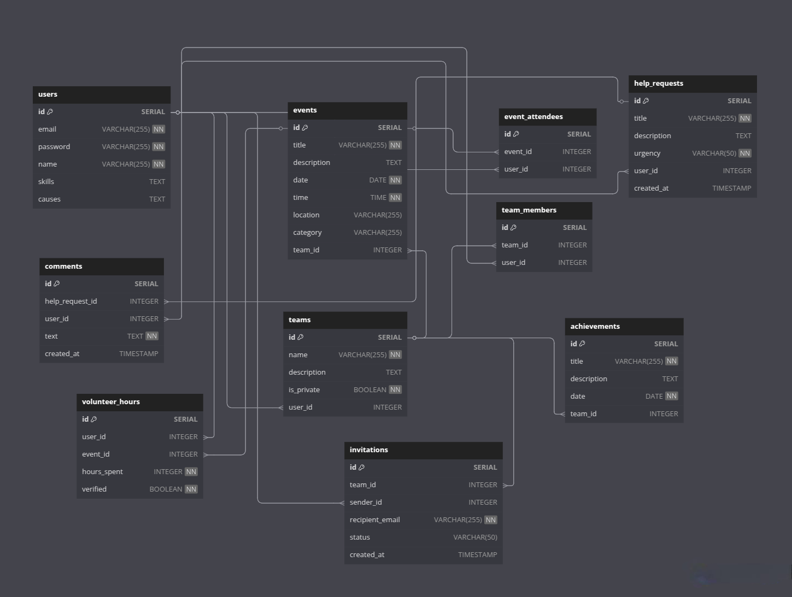

# HandsOn - Community Volunteering Platform


## Table of Contents

1. [Project Overview](#project-overview)
2. [Website Overview](#website-overview)
3. [Technologies Used](#technologies-used)
4. [Features](#features)
5. [Database Schema](#database-schema)
6. [Setup Instructions](#setup-instructions)
7. [API Documentation](#api-documentation)
   - [User Authentication](#user-authentication)
   - [Event Management](#event-management)
   - [Help Requests](#help-requests)
   - [Volunteer Hours](#volunteer-hours)
8. [Running the Project](#running-the-project)

## Project Overview

HandsOn is a community-driven social volunteering platform that connects individuals with meaningful social impact opportunities. Users can discover and join volunteer-driven events, post requests for community help, form teams for large-scale initiatives, and track their impact with contributions logged on a personal and team level. This platform encourages social responsibility, community collaboration, and proactive engagement in volunteer work.

## Website Overview

https://github.com/user-attachments/assets/34e16679-24f3-440a-8809-68adf79cd6d6

## Technologies Used

- Node.js
- Express.js
- PostgreSQL
- React.js
- Vite
- Tailwind CSS
- JWT for authentication

## Features

- User Registration & Profile Management
- Discover & Join Volunteer Events
- Community Help Requests
- Form Teams(private and public)
- Impact Tracking & Social Recognition

## Database Schema



## Setup Instructions

1. Clone the repository:
   ```
   git clone https://github.com/yourusername/hands-on-volunteering-platform.git
   ```
2. Navigate to the project directory and install dependencies:
   ```
   cd hands-on-volunteering-platform
   npm install
   ```
3. Navigate to the backend directory and install dependencies:
   ```
   cd backend
   npm install
   ```
4. Set up the database:
   - Copy script from [here](backend/src/database/schema.sql) and paste to `PostgreSQL` terminal
6. Start the backend server:
   ```
   npm run dev
   ```
7. Navigate to the frontend directory and install dependencies:
   ```
   cd ../frontend
   npm install
   ```
8. Start the frontend application:
   ```
   npm run dev
   ```

## API Documentation
[Ref: [Postman Collection](backend/postman/HandsOn.postman_collection.json)] 

### User Authentication

- **User Registration**: `POST /api/users/register`
  - **Request Body:**
    ```json
    {
      "email": "user@example.com",
      "password": "password123",
      "name": "Azraf Sami",
      "skills": "Programming, Teaching",
      "causes": "Education, Environment"
    }
    ```
- **User Login**: `POST /api/users/login`
  - **Request Body:**
    ```json
    {
      "email": "user@example.com",
      "password": "password123"
    }
    ```
- **Update User Info**: `PUT /api/users/:id`
  - **Request Body:**
    ```json
    {
      "email": "newemail@example.com",
      "name": "New Name",
      "skills": ["communication", "leadership"],
      "causes": ["environment", "education"]
    }
    ```

### Event Management

- **Create Event**: `POST /api/events/create`
  - **Request Body:**
    ```json
    {
      "title": "Lake Cleanup",
      "description": "Clean Gulshan lake.",
      "date": "2025-03-15",
      "time": "10:00:00",
      "location": "Gulshan",
      "category": "Environment"
    }
    ```
- **List Events**: `GET /api/events/list`
- **Join Event**: `POST /api/events/join`
  - **Request Body:**
    ```json
    {
      "eventId": 1,
      "userId": 1
    }
    ```
- **Withdraw from Event**: `POST /api/events/withdraw`
  - **Request Body:**
    ```json
    {
      "eventId": 1,
      "userId": 1
    }
    ```

### Help Requests

- **Create Help Request**: `POST /api/help-requests`
  - **Request Body:**
    
    ```json
    {
      "title": "Justice for Achiya",
      "description": "Protest",
      "location": "Mirpur",
      "category": "Community Assistance"
    }
    ```
    
- **List Help Requests**: `GET /api/help-requests/list`

### Volunteer Hours

- **Log Volunteer Hours**: `POST /api/volunteer-hours`
  - **Request Body:**
    ```json
    {
      "userId": 1,
      "eventId": 2,
      "hours": 5
    }
    ```

## Running the Project

To run the project locally, follow the setup instructions above. For production, ensure to set environment variables and build the frontend application using:

```
npm start
```

